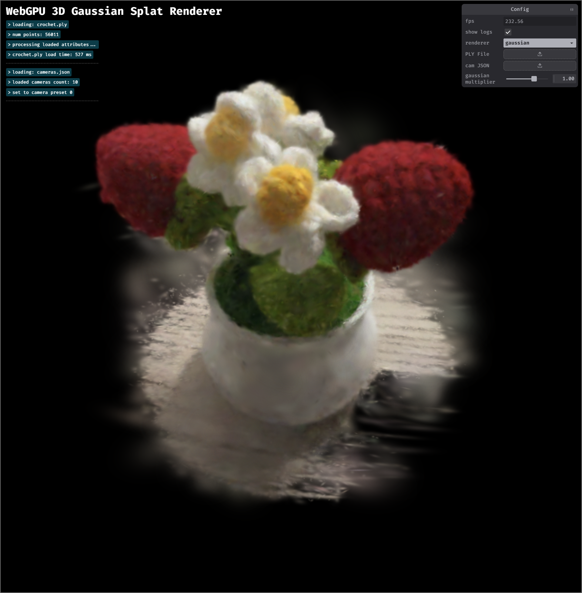
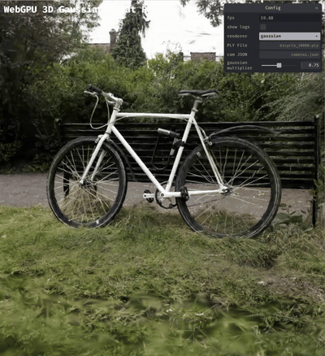
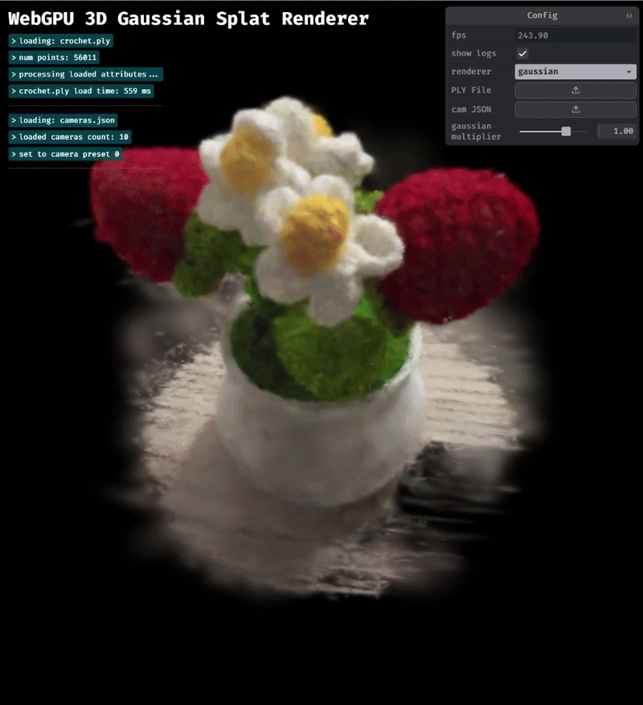

# Gaussian Splat Renderer in WebGPU

## [Live Deployment on my Personal Portfolio Domain Here](https://gaussian-splat-renderer.webgpu.amyliu.dev/)

## Overview
This project implements a real-time 3D Gaussian Splat Viewer using WebGPU. It visualizes pre-trained Gaussian point cloud data by reconstructing continuous surfaces from discrete splats, inspired by the 3D Gaussian Splatting paper (Kerbl et al., 2023). The viewer supports both a basic point cloud renderer and a fully featured Gaussian renderer with compute-based preprocessing and depth sorting.

In the simple Point Cloud Renderer, points are transformed using the Model–View–Projection (MVP) matrix and drawn onto the canvas using a render pipeline. 

In the Gaussian Renderer, each 3D Gaussian is preprocessed into a 2D screen-space quad that accounts for scale, rotation, and color derived from spherical harmonics coefficients. The renderer performs view-frustum culling, covariance computation, SH color evaluation, and back-to-front depth sorting to produce accurate transparency and smooth blending.

This project demonstrates key GPU programming concepts including compute pipelines, indirect drawing, atomic operations, and shader-based data processing in WGSL. It also highlights performance tradeoffs in workgroup sizing, culling, and Gaussian density for real-time rendering in WebGPU.

### Credits

- [Vite](https://vitejs.dev/)
- [tweakpane](https://tweakpane.github.io/docs//v3/monitor-bindings/)
- [stats.js](https://github.com/mrdoob/stats.js)
- [wgpu-matrix](https://github.com/greggman/wgpu-matrix)
- Special Thanks to: Shrek Shao (Google WebGPU team) & [Differential Guassian Renderer](https://github.com/graphdeco-inria/diff-gaussian-rasterization)

## Fine Details
### Developer Info
Amy Liu -- [Personal Website](https://amyliu.dev), [LinkedIn](https://linkedin.com/in/miyalana), [Github](https://github.com/mialana).

### Tested on
- Browser Provider: Google Chromium
- Desktops:
  -  Fedora 42 KDE Plasma, Wayland Protocol, Optimus GPU (Intel(R) Core(TM) Ultra 9 275HX 32GiB, NVIDIA GeForce RTX 5070Ti 12227MiB)
  -  Windows 22, Optimus GPU (Intel(R) Core(TM) Ultra 9 275HX 32GiB, NVIDIA GeForce RTX 5070Ti 12227MiB)