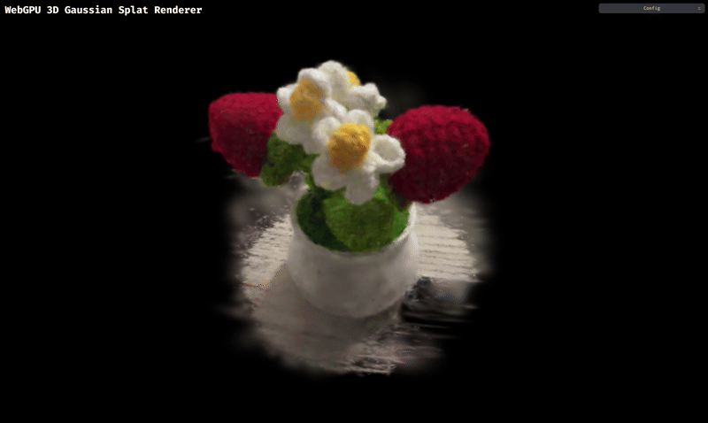
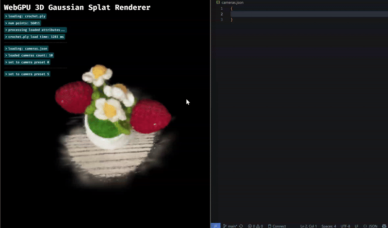

# Gaussian Splat Renderer in WebGPU

## [Live Deployment on my Personal Portfolio Domain Here](https://gaussian-splat-renderer.webgpu.amyliu.dev/)

## Overview

This project implements a real-time 3D Gaussian Splat Viewer using WebGPU. It visualizes pre-trained Gaussian point cloud data by reconstructing continuous surfaces from discrete splats, inspired by the 3D Gaussian Splatting paper (Kerbl et al., 2023). The viewer supports both a basic point cloud renderer and a fully featured Gaussian renderer with compute-based preprocessing and depth sorting.

In the simple Point Cloud Renderer, points are transformed using the Model–View–Projection (MVP) matrix and drawn onto the canvas using a render pipeline.

In the Gaussian Renderer, each 3D Gaussian is preprocessed into a 2D screen-space quad that accounts for scale, rotation, and color derived from spherical harmonics coefficients. The renderer performs view-frustum culling, covariance computation, SH color evaluation, and back-to-front depth sorting to produce accurate transparency and smooth blending.

This project demonstrates key GPU programming concepts including compute pipelines, indirect drawing, atomic operations, and shader-based data processing in WGSL. It also highlights performance tradeoffs in workgroup sizing, culling, and Gaussian density for real-time rendering in WebGPU.

## Table of Contents

- [Gaussian Splat Renderer in WebGPU](#gaussian-splat-renderer-in-webgpu)
  - [Live Deployment on my Personal Portfolio Domain Here](#live-deployment-on-my-personal-portfolio-domain-here)
  - [Overview](#overview)
  - [Table of Contents](#table-of-contents)
  - [Details](#details)
    - [Renderer Camera Controls](#renderer-camera-controls)
  - [Performance Analysis](#performance-analysis)
    - [Load Time Comparison (Gaussian vs Point Cloud)](#load-time-comparison-gaussian-vs-point-cloud)
    - [FPS Comparison (Point Cloud vs Gaussian)](#fps-comparison-point-cloud-vs-gaussian)
    - [Gaussian FPS vs Workgroup Size](#gaussian-fps-vs-workgroup-size)
    - [Gaussian FPS With and Without View-Frustum Culling (Workgroup Size 256)](#gaussian-fps-with-and-without-view-frustum-culling-workgroup-size-256)
  - [GUI Add-Ons](#gui-add-ons)
    - [**Copy Camera Transform to Clipboard Demo**](#copy-camera-transform-to-clipboard-demo)
    - [**Gaussian Multiplier GUI Demo**](#gaussian-multiplier-gui-demo)
    - [**Hiding Logs GUI Demo (because why not?)**](#hiding-logs-gui-demo-because-why-not)
  - [Custom Splatting and Reducing Splat Size](#custom-splatting-and-reducing-splat-size)
  - [Credits](#credits)
  - [Fine Details](#fine-details)
    - [Developer Info](#developer-info)
    - [Tested on](#tested-on)

## Details

[Download example splats and camera configuration JSON files for `bicycle_3000` (6131954 points) and `bonsai` (272956 points) here.](https://drive.google.com/drive/folders/1Fz0QhyDU12JTsl2e7umGi5iy_V9drrIW)

Custom Crochet Flower Pot Splat (56011 points) is included on default when the site is loaded.

**Note:** The artifacts visible in the GIF on the mesh are due to an unoptimized PLY model and not from the implemented renderer algorithm. This non-optimized decision was made in order to keep file size minimal and host-able ([Details Here](#custom-splatting-and-reducing-splat-size)). 

**`crochet.ply` Hosted At:** [https://gaussian-splat-renderer.webgpu.amyliu.dev/resources/crochet/crochet.ply](https://gaussian-splat-renderer.webgpu.amyliu.dev/resources/crochet/crochet.ply) or `public/resources/crochet/crochet.ply` in the repository filepath.

**`cameras.json` for Crochet Model Hosted At:** [https://gaussian-splat-renderer.webgpu.amyliu.dev/resources/crochet/cameras.json](https://gaussian-splat-renderer.webgpu.amyliu.dev/resources/crochet/cameras.json) or `public/resources/crochet/cameras.json` in the repository filepath.

### Renderer Camera Controls
- Rotate: Left-mouse button
- Pan: Right-mouse button
- Zoom: Middle scroll bar or "two-finger enlarge" using mousepad
- Copy Camera Transform to Clipboard: Spacebar ([Details Here](#gui-add-ons))

## Performance Analysis

### Load Time Comparison (Gaussian vs Point Cloud)

| Model        | Num Points | Gaussian Load Time | Point Cloud Load Time | Difference |
| ------------ | ---------- | ------------------ | --------------------- | ---------- |
| Crochet      | 56,011     | 636 ms             | 620 ms                | +16 ms     |
| bonsai       | 272,956    | 2,873 ms           | 2,276 ms              | +597 ms    |
| bicycle_3000 | 6,131,954  | 93,576 ms          | 89,814 ms             | +3,762 ms  |

This actually shows that the long load time of larger models is actually mostly due to the sorting phase that occurs during loading, and is done in both the pointcloud renderer and gaussian renderer.
The gaussian renderer itself has a much shorter processing period.

---

### FPS Comparison (Point Cloud vs Gaussian)

| Model        | Point Cloud FPS | Gaussian FPS (avg) | Difference |
| ------------ | --------------- | ------------------ | ---------- |
| Crochet      | 240             | 247                | +7         |
| bonsai       | 240             | 244                | +4         |
| bicycle_3000 | 240             | 45 (avg)           | -195       |

---

### Gaussian FPS vs Workgroup Size

| Model        | 64  | 128 | 256 |
| ------------ | --- | --- | --- |
| Crochet      | 220 | 248 | 247 |
| bonsai       | 220 | 249 | 242 |
| bicycle_3000 | 28  | 67  | 41  |

Performance peaks at 128 threads per group.

---

### Gaussian FPS With and Without View-Frustum Culling (Workgroup Size 256)

| Model        | With Culling | Without Culling | Improvement |
| ------------ | ------------ | --------------- | ----------- |
| Crochet      | 247          | 240             | +7 FPS      |
| bonsai       | 242          | 181             | +61 FPS     |
| bicycle_3000 | 41           | 4               | +37 FPS     |

View-frustum culling greatly improves performance, especially on large models, by skipping off-screen Gaussian computations.

## GUI Add-Ons

Along with a more stylized CSS theme, I added a custom UI feature that helped me during my gaussian debugging phase.

Pressing the **spacebar** captures the camera’s **current rotation and translation**, prints them to the on-screen console, and automatically copies the values to the clipboard.

These copied values are in the desired format to be pasted directly into the `cameras.json` file that provide camera preset frames for each model, making it easier to return to specific viewpoints for testing and visualization.

### **Copy Camera Transform to Clipboard Demo**

### **Gaussian Multiplier GUI Demo**

### **Hiding Logs GUI Demo (because why not?)**

## Custom Splatting and Reducing Splat Size

The above feature resulted from the fact that I loaded in my own custom trained gaussian splat model that I took at home of a crocheted flower pot. That process was very quick and interesting, using [Scaniverse](https://scaniverse.com/) to generate the splat and the[SuperSplat](https://superspl.at/editor/) editor interface to remove all splats in the scene besiders a small sphere around the pot. I do think that the splat quality has some room from improvement ("missing", undetected splats in some parts of the model) but it is quite good for the ~4 minute training time.

And actually, the desire to create a custom splat was because the provided `bonsai` scene was too large for the maximum allowed Cloudflare Pages filesize of 25mb. I didn't like the idea that visitors of my site would need to first go and download a viable `.ply` file before they could test out my renderer, so I needed a smaller `.ply` file that could be easily placed in my `public` folder and hosted.

Along those lines, a future TODO is that I briefly attempted to support loading in the [Compressed Splat Format](https://blog.playcanvas.com/compressing-gaussian-splats/) developed by SuperSplat. It currently can successfully load in the pointcloud of a `*.compressed.ply` file.

However, colors are not parsed correctly, resulting in the gaussian renderer to draw black-and-white splats. I only briefly tried to debug it and have not fixed it yet, but plan to.

## Credits

- [Vite](https://vitejs.dev/)
- [tweakpane](https://tweakpane.github.io/docs//v3/monitor-bindings/)
- [stats.js](https://github.com/mrdoob/stats.js)
- [wgpu-matrix](https://github.com/greggman/wgpu-matrix)
- Special Thanks to: Shrek Shao (Google WebGPU team) & [Differential Guassian Renderer](https://github.com/graphdeco-inria/diff-gaussian-rasterization)

## Fine Details

### Developer Info

Amy Liu -- [Personal Website](https://amyliu.dev), [LinkedIn](https://linkedin.com/in/miyalana), [Github](https://github.com/mialana).

### Tested on

- Browser Provider: Google Chromium
- Desktops:
    - Fedora 42 KDE Plasma, Wayland Protocol, Optimus GPU (Intel(R) Core(TM) Ultra 9 275HX 32GiB, NVIDIA GeForce RTX 5070Ti 12227MiB)
    - Windows 22, Optimus GPU (Intel(R) Core(TM) Ultra 9 275HX 32GiB, NVIDIA GeForce RTX 5070Ti 12227MiB)
